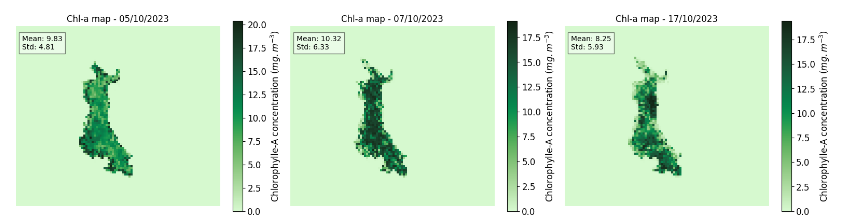

<!-- Improved compatibility of back to top link: See: https://github.com/othneildrew/Best-README-Template/pull/73 -->
<a name="readme-top"></a>
<!--
*** Thanks for checking out the Best-README-Template. If you have a suggestion
*** that would make this better, please fork the repo and create a pull request
*** or simply open an issue with the tag "enhancement".
*** Don't forget to give the project a star!
*** Thanks again! Now go create something AMAZING! :D
-->


<!-- PROJECT SHIELDS -->
<!--
*** I'm using markdown "reference style" links for readability.
*** Reference links are enclosed in brackets [ ] instead of parentheses ( ).
*** See the bottom of this document for the declaration of the reference variables
*** for contributors-url, forks-url, etc. This is an optional, concise syntax you may use.
*** https://www.markdownguide.org/basic-syntax/#reference-style-links
-->
[![Contributors][contributors-shield]][contributors-url]
[![Stargazers][stars-shield]][stars-url]
[![Issues][issues-shield]][issues-url]
[![MIT License][license-shield]][license-url]


<!-- PROJECT LOGO -->
<br />
<div align="center">
  <a href="https://github.com/ArthurCosta68/remote_sensing_lac_creteil">
    
  </a>

<h3 align="center">Retrieval of Chlorophyll A concentration in Cretéil Lake Based on Sentinel-2 L1C MSI Imagery</h3>

  <p align="center">
    This is a scientific project focused on estimate chl-a concentration based on several images of Sentinel-2 L1C MSI Imagery, testing some algorithms of estimation and creating .ipynb with all the results.
    <br />
    <a href="https://github.com/ArthurCosta68/remote_sensing_lac_creteil"><strong>Explore the docs »</strong></a>
    <br />
    <br />
    <a href="https://github.com/ArthurCosta68/remote_sensing_lac_creteil/issues/new?labels=bug&template=bug-report---.md">Report Bug</a>
    ·
    <a href="https://github.com/ArthurCosta68/remote_sensing_lac_creteil/issues/new?labels=enhancement&template=feature-request---.md">Request Feature</a>
  </p>
</div>


<!-- TABLE OF CONTENTS -->
<details>
  <summary>Table of Contents</summary>
  <ol>
    <li>
      <a href="#about-the-project">About The Project</a>
      <ul>
        <li><a href="#built-with">Built With</a></li>
      </ul>
    </li>
    <li>
      <a href="#getting-started">Getting Started</a>
      <ul>
        <li><a href="#prerequisites">Prerequisites</a></li>
        <li><a href="#installation">Installation</a></li>
      </ul>
    </li>
    <li><a href="#documentation">Documentation</a></li>
    <li><a href="#license">License</a></li>
    <li><a href="#contact">Contact</a></li>
  </ol>
</details>


<!-- ABOUT THE PROJECT -->
## About The Project

<div align="center">
  <a href="https://github.com/ArthurCosta68/remote_sensing_lac_creteil">
    
  </a>
</div>

This is a project based on the processing of L1C Sentinel-2 MSI images with a focus on estimating and monitoring the concentration of chlorophyll in Lake Creteil, France.


<p align="right">(<a href="#readme-top">back to top</a>)</p>


### Built With

* Python
* SNAP
* Anaconda Package (Jupyter Notebooks)
  
<p align="right">(<a href="#readme-top">back to top</a>)</p>


<!-- GETTING STARTED -->
## Getting Started

To get a local copy up and running follow these simple steps below.

### Prerequisites

You will need to download the Sentinel-2 L1C images from the <a href="https://browser.dataspace.copernicus.eu/">Copernicus Browser</a> according to the step-by-step instructions in <a href="https://docs.google.com/document/d/1Gnr0V2lDPDaKHO1aw9GVlVBHqAi4EJh1/edit?usp=sharing&ouid=106343832988692791427&rtpof=true&sd=true">Appendix 1</a> and place them in the L1C_zip_files folder.


### Installation

1. Install Anaconda from https://www.anaconda.com/download
2. Install VSCode from https://code.visualstudio.com/download
3. Install git from https://git-scm.com/downloads
4. Install github from https://desktop.github.com/
5. Install https://step.esa.int/main/download/snap-download/ version 9.0

6. Clone the repo in GitHub Desktop
   ```sh
   git clone https://github.com/ArthurCosta68/remote_sensing_lac_creteil.git
   ```
7. Create virtual env in Anaconda Prompt
   ```sh
   conda create --name projet_lac_creteil Python=3.9.18
   ```
8. Activate virtual env in Anaconda Prompt

    ```sh
   conda activate projet_lac_creteil
   ```
9. Open the repository in Repository -> Open in Visual Studio Code

10. Install all the extensions in extensions.txt


<p align="right">(<a href="#readme-top">back to top</a>)</p>


<!-- USAGE EXAMPLES -->
## Documentation

### Quick Guide - Step by Step

This is the step-by-step process for running the code. To understand the algorithms, see the "#Preprocessing" section below. The step-by-step is divided into two stages: Images for Training and Images for Validation.

#### Images for training:

1. Select and download the images in the Copernicus Browser

2. Place the images (.zip) in the L1C_zip_files folder

3. Obtain the temperature, pressure and ozone data for the days of the selected images, and place all the information in the file data/meteo_data.csv

4. After that, you can run all the code in the pre_processing.ipynb file. This file will generate two files in the data folder: 
	1. data/results_window_calculation_final.csv which consolidates the data from the analysis of the 3x3 and 5x5 windows (Look at the last column).
	2. data/results_final_bands_final.csv which consolidates the data from the analysis of the pxiels of the entire lake.
Both are in different formats, but what should be extracted from them for further analysis is the mean and standard deviation of the "conc_chl" variable.

5. As mentioned in the previous step, conc_chl should be extracted and added to the file Analysis_folder/results_consolidate_for_pandas_v2.xlsx where, on the results_initial tab, the dates of the images should be added, as well as the information on the mean and standard deviation of the bio-optical models. Chlorophyll concentration data should also be added to the file on the "data_loco" tab. If available, the relevant data can be added to the "vimeo_data_sentor", "meteo" and "laboratory_data" tabs.

6. After running the pre-processing stage, pre-processed images will be generated in the c2rcc_final_bands folder, each of which must be opened in SNAP and converted to a GeoTIFF file (Select the image in SNAP and go to File->Export-> GeoTiff) and saved in the "Analysis_folder/tif_files" folder.

7. You can then run the first cells of the Data Processing session of the results_analysis_v2 file. You may need to adjust the relevant dates for the new images and in situ chlorophyll data obtained in the graph slicers.

8. In the "Analysis using directly information from TIF files" section, there will be a step where the model parameters will be adjusted. With this adjustment, you can change the model parameters in the "data/STEP3_chla_algorithms_calculation.xml" file, which is used in the pre-processing stage to obtain the validation images.

9. After running this entire session, you will be able to obtain, both using the pre-processing data and the band data directly from the image, the scatter plots and, in the case of analysis directly from GeoTIFF, the chlorophyll concentration maps.

### Images for validation:

1. Select and download the images in the Copernicus Browser

2. Place the images (.zip) in the L1C_zip_files folder

3. Obtain the temperature, pressure and ozone data for the days of the selected images, and place all the information in the file data/meteo_data.csv

4. After that, you can run all the code in the pre_processing.ipynb file. This file will generate two files in the data folder: 
	1. data/results_window_calculation_final.csv which consolidates the data from the analysis of the 3x3 and 5x5 windows (Look at the last column).
	2. data/results_final_bands_final.csv which consolidates the data from the analysis of the pxiels of the entire lake.
Both are in different formats, but what should be extracted from them for further analysis is the mean and standard deviation of the "conc_chl" variable.

5. As mentioned in the previous step, the conc_chl should be extracted and added to the file Analysis_folder/results_consolidate_for_pandas_v2.xlsx where, on the results_final tab, the dates of the images should be added, as well as the information on the mean and standard deviation of the conc_chl from the files generated in the previous step. Chlorophyll concentration data should also be added to the file on the data_loco_validation tab. If necessary, the relevant data can be added to the "vimeo_data_sentor", "meteo_data" and "laboratory_data" tabs.

6. After running the pre-processing stage, pre-processed images will be generated in the c2rcc_final_bands folder, each of which must be opened in SNAP and converted to a GeoTIFF file (Select the image in SNAP and go to File->Export-> GeoTiff) and saved in the "Analysis_folder/validation_images_tif" folder.

7. You can then run the cells from the last "Data Processing Foz" session in the results_analysis_v2 file. You may need to adjust the relevant dates in the graph slicers for the new images and in situ chlorophyll data obtained.

8. After running this entire session, you will be able to obtain, either using the pre-processing data or the band data directly from the image, the scatter plots and, in the case of analysis directly from GeoTIFF, the chlorophyll concentration maps.

### Pre-processing explained

The code (<a href="https://github.com/ArthurCosta68/remote_sensing_lac_creteil/blob/main/pre_processing.ipynb"> pre_processing.ipynb </a>) has the following pre-processing steps:

#### Subset & Resample

In the first step, the code uses the L1C images contained in the L1C_zip_files folder together with the SNAP processing in xml (data/STEP1_subset_resample_mask.xml) and saves the new images after renaming in the "l1c_ressampled_masked" folder.


#### Meteo Data

For get Temperature data, you need to extract from Grafana.
Ozone data, you will use the script on data/ozone_final.ipynb, after you extract the URLs for download the products from  https://disc.gsfc.nasa.gov/datasets/OMTO3_003/summary.
And finally, for Pressure, you will need to download data of Surface pressure from https://psl.noaa.gov/data/gridded/data.ncep.reanalysis2.html

#### C2RCC atmospheric correction

In the second step, the C2RCC correction is performed on the previous images.

The variables "output_folder", "met_data", "param_file" and "input_folder" are defined, which respectively represent the output folder, the path to the meteorological data file, the path to the C2RCC correction parameter file and the input folder containing the images to be processed.

The "process_c2rcc_correction" function is defined to perform C2RCC correction processing on the images. It receives the variables mentioned above as arguments.

Within the function, the old suffix and the new suffix are defined for the names of the input and output files. It then loops through the files in the input folder. Only files with a ".dim" extension are considered.

For each file, the name and acquisition date are extracted. Next, the meteorological data file is read and the ozone, pressure and temperature values corresponding to the acquisition date of the current file are extracted.

The name of the output file is generated by replacing the old suffix with the new suffix. The full path to the output file is constructed using the output folder and the output file name.

A command is created to perform C2RCC processing using the "gpt" program (which is SNAP's CLI) and the appropriate parameters. The command is executed using the "subprocess.run" function and the results are printed on the standard output.

Finally, the "process_c2rcc_correction" function is called with the appropriate arguments to perform the processing on the images in the input folder.


##### (Optional) Others C2RCC atmospheric correction

It is important to note that steps 2.1 and 2.2 use the same principle as last step, but 2.1 uses the meteorological data without the ozone data. Step 2.2 uses a different type of correction to the standard C2RCC, which is C2RCC C2-Nets.

#### Bio-optical models calculation

After the correction, bio-optical calculations are carried out using the remote sensing reflectances of the corrected bands to calculate the chlorophyll concentration.

In addition to the model automatically generated by C2RCC, the following 5 models were used:

1. 3_bands_model_chl_conc - 161.24*((1/ rrs_B4 - 1/ rrs_B5)/(1/ rrs_B6 - 1/ rrs_B5))+28.04
2. empirical_2_bands_equation1 - 136.3 * (rrs_B6/rrs_B4) - 16.2
3. empirical_2_bands_equation2 - 25.28*((rrs_B5/rrs_B4)*(rrs_B5/rrs_B4)) + 14.85 * (rrs_B5/rrs_B4) - 15.18
4. empirical_3_bands_equation1 - 117.42 * ((1/rrs_B4 - 1/rrs_B5))*rrs_B6 + 23.174
5. empirical_3_bands_equation3 - 315.5 * (((1/rrs_B4 - 1/rrs_B5))*rrs_B6)*(((1/rrs_B4 - 1/rrs_B5))*rrs_B6)+ 215.95 * ((1/rrs_B4 - 1/rrs_B5))*rrs_B6 + 25.66

The script takes input files from the 'c2rcc' folder, applies the calculations defined in the 'STEP3_chla_algorithms_calculation.xml' graph file,
and saves the output files with modified names in the 'c2rcc_final_bands' folder.

The script uses the 'gpt' command-line tool to execute the graph file and perform the calculations.


#### Extract values of the bands

Finally, different forms of extraction defined by the files generated by SNAP were used:
  1. **data/STEP4_1_pixel_values_extraction_3x3.xml**

The main statistical indicators were extracted, in a 3x3 pixel window around the creteil lake station, from all the bands suitable for analysis.

  2. **data/STEP4_2_pixel_values_extraction_5x5.xml**

The main statistical indicators were extracted in a 5x5 pixel window around the creteil lake station, from all the bands suitable for analysis.

After extracting the 3x3 and 5x5 window, the data is consolidated in the file data/results_window_calculation_final.csv

  3. **STEP4_3_all_pixels_extraction_StatisticOperator.xml**

The statistical indicators for each band were extracted for all the pixels. This data was saved in data/results_final_bands_final.csv

<p align="right">(<a href="#readme-top">back to top</a>)</p>

<!-- LICENSE -->
## License

Distributed under the MIT License. See `LICENSE.txt` for more information.

<p align="right">(<a href="#readme-top">back to top</a>)</p>


<!-- CONTACT -->
## Contact

Arthur Costa Cavalcante - arthurt68@gmail.com

Project Link: [https://github.com/ArthurCosta68/remote_sensing_lac_creteil](https://github.com/ArthurCosta68/remote_sensing_lac_creteil)

<p align="right">(<a href="#readme-top">back to top</a>)</p>


<!-- MARKDOWN LINKS & IMAGES -->
<!-- https://www.markdownguide.org/basic-syntax/#reference-style-links -->
[contributors-shield]: https://img.shields.io/github/contributors/ArthurCosta68/remote_sensing_lac_creteil.svg?style=for-the-badge
[contributors-url]: https://github.com/ArthurCosta68/remote_sensing_lac_creteil/graphs/contributors
[forks-shield]: https://img.shields.io/github/forks/ArthurCosta68/remote_sensing_lac_creteil.svg?style=for-the-badge
[forks-url]: https://github.com/ArthurCosta68/remote_sensing_lac_creteil/network/members
[stars-shield]: https://img.shields.io/github/stars/ArthurCosta68/remote_sensing_lac_creteil.svg?style=for-the-badge
[stars-url]: https://github.com/ArthurCosta68/remote_sensing_lac_creteil/stargazers
[issues-shield]: https://img.shields.io/github/issues/ArthurCosta68/remote_sensing_lac_creteil.svg?style=for-the-badge
[issues-url]: https://github.com/ArthurCosta68/remote_sensing_lac_creteil/issues
[license-shield]: https://img.shields.io/github/license/ArthurCosta68/remote_sensing_lac_creteil.svg?style=for-the-badge
[license-url]: https://github.com/ArthurCosta68/remote_sensing_lac_creteil/blob/master/LICENSE.txt
[linkedin-shield]: https://img.shields.io/badge/-LinkedIn-black.svg?style=for-the-badge&logo=linkedin&colorB=555
[product-screenshot]: data/images/imagem_produto_final.png
[Next.js]: https://img.shields.io/badge/next.js-000000?style=for-the-badge&logo=nextdotjs&logoColor=white
[Next-url]: https://nextjs.org/
[React.js]: https://img.shields.io/badge/React-20232A?style=for-the-badge&logo=react&logoColor=61DAFB
[React-url]: https://reactjs.org/
[Vue.js]: https://img.shields.io/badge/Vue.js-35495E?style=for-the-badge&logo=vuedotjs&logoColor=4FC08D
[Vue-url]: https://vuejs.org/
[Angular.io]: https://img.shields.io/badge/Angular-DD0031?style=for-the-badge&logo=angular&logoColor=white
[Angular-url]: https://angular.io/
[Svelte.dev]: https://img.shields.io/badge/Svelte-4A4A55?style=for-the-badge&logo=svelte&logoColor=FF3E00
[Svelte-url]: https://svelte.dev/
[Laravel.com]: https://img.shields.io/badge/Laravel-FF2D20?style=for-the-badge&logo=laravel&logoColor=white
[Laravel-url]: https://laravel.com
[Bootstrap.com]: https://img.shields.io/badge/Bootstrap-563D7C?style=for-the-badge&logo=bootstrap&logoColor=white
[Bootstrap-url]: https://getbootstrap.com
[JQuery.com]: https://img.shields.io/badge/jQuery-0769AD?style=for-the-badge&logo=jquery&logoColor=white
[JQuery-url]: https://jquery.com 
